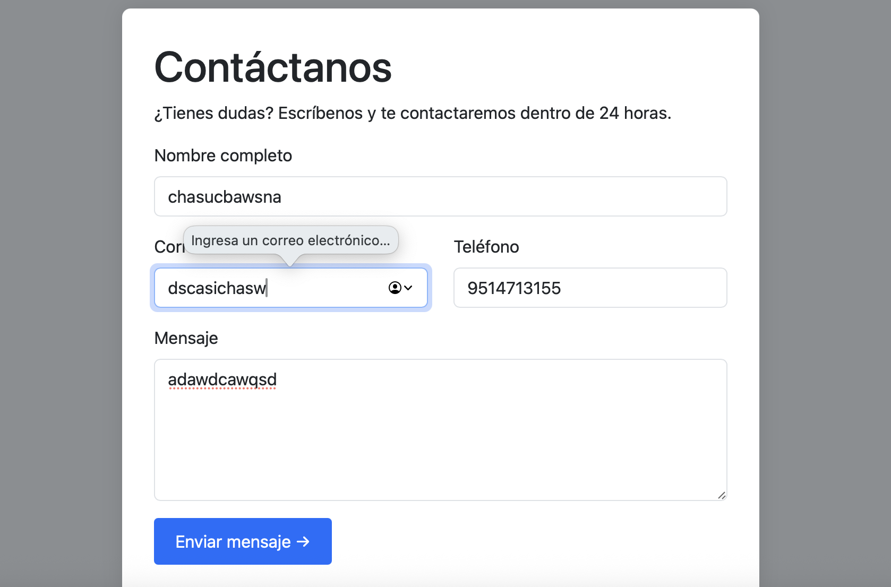
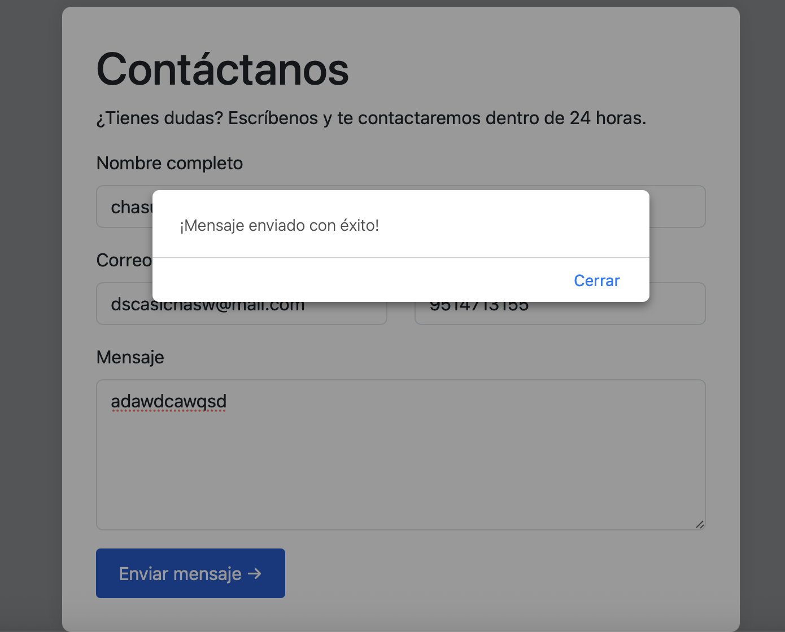
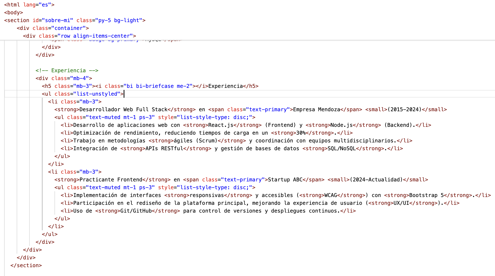
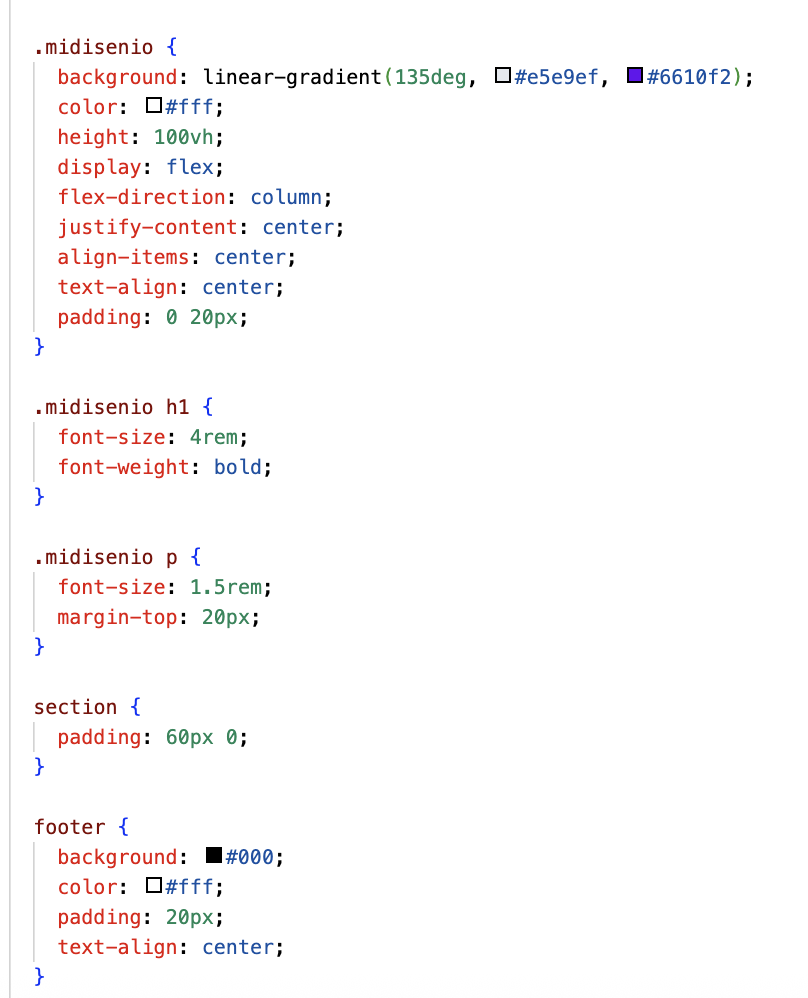

#  Mi Portafolio Personal  

[](https://github.com/tuusuario/portafolio)
[](https://tuusuario.github.io/portafolio/)

Portafolio personal donde muestro mis proyectos, habilidades técnicas y experiencia como desarrollador. Diseñado para ser responsive y accesible.  

## Características  
- **Proyectos destacados** con descripción y tecnologías usadas.  
-  **Diseño responsive** (adaptable a móviles, tablets y desktop).  
-  **Interfaz moderna** con animaciones CSS/JS.  
-  **Sección de contacto** integrada con redes sociales y formulario.  
-  **SEO optimizado** (meta tags, keywords, etc.).  

## 🌍 Ver Online  
👉 [Haz clic aquí para visitar el sitio](https://tuusuario.github.io/MiPortafolio/)  

##  Tecnologías Utilizadas  
- **Frontend**: HTML5, CSS3, JavaScript (ES6+), Bootstrap 5.  
- **Herramientas**: Git, GitHub Pages, Figma (diseño).  

##  Instalación y Descarga  
### Opción 1: Clonar el repositorio  

``` html
git clone https://github.com/tuusuario/portafolio.git

```


## Capturas de Pantalla

## 🖼️ Capturas de Pantalla

<div align="center">
  
  
  <br>
  
  
</div>

## Licencia
Este proyecto es para fines académicos. El código puede usarse como referencia, pero se requiere atribución.


## Contacto
Reynaldo Roman Mendoza
 rreynaldoromanm@gmail.com
LinkedIn (opcional)


